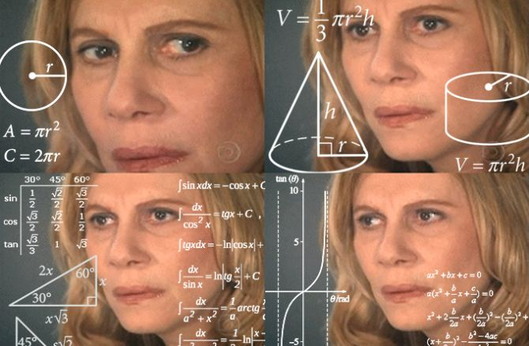

# Motivation
I have heard about these types of simulations for a long time, but I never knew exactly how they worked. I want to give it a try and learn the mechanics firsthand. 

  

I believe Mesa can help researchers significantly, since it allows them to extend their work in many aspects. 

This project connects deeply with my core values: nature, technology, and humanity living and growing together.

## Who I am
I am a Computer Engineering student with a passion for innovation and competitive problem-solving. I find great purpose in using my technical knowledge to solve challenges in other fields, ensuring that my solutions are not only effective but also optimized to use minimal energy and resources.

  

Beyond engineering, I am fascinated by business and marketing. My goal is to be an engineer who builds products with a real user base in mind. My technical toolkit includes:

Data & Analysis: R for data analysis and visualization.

Backend & AI: Python for backend development and Machine Learning.

Core Engineering: C/C++, OOP, and Data Structures (DSA) for efficient data management.

You can find my work with various frameworks and projects on my GitHub profile.

## Why Mesa
I was drawn to Mesa through GSoC because I want to deeply understand the inner workings of Agent-Based Modeling (ABM). Although I haven’t used Mesa before, it immediately caught my eye as a "new dot" that I can connect with my year of experience in Machine Learning. 

I believe that contributing mesa will allow me to extend my technical skills, eventuall y helping me build my own startup that bridges the gap between technology and real-world systems.

  

## What I want to learn
The thing I am most excited about is learning things I can’t even imagine yet. Since ABM is a completely new field for me. I want to understand the logic and architecture of Mesa from the inside. I'm very interested in how to make these simulations run faster and accurately.

Also,  I want to see if I can use machine learning to make agents smarter or more realistic. 
## Where I want to go
I want to become a contributor who helps Mesa extend into new industries. I don’t just want to learn I want to produce work that has real users and helps researchers solve problems
